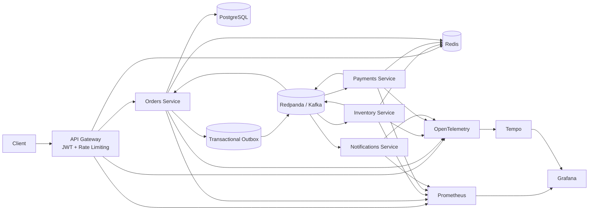

# Event-Driven Microservices Platform

A production-style event-driven backend demonstrating asynchronous microservices, Saga-based distributed workflows, transactional outbox messaging, idempotent consumers, retries and dead-letter queues, observability, authentication, rate limiting, containerization, testing, and Kubernetes deployment manifests.

[](https://github.com/AbhiZenin/event-driven-microservices/actions/workflows/ci.yml)

---

## Architecture



---

## Core Workflow

A successful order follows an asynchronous Saga:

```text
POST /api/orders
        │
        ▼
    API Gateway
        │
        ▼
   Orders Service
        │
        │ PostgreSQL transaction
        ├──────────────► Order
        │
        └──────────────► Outbox Event
                              │
                              ▼
                         OrderCreated
                              │
                              ▼
                       Inventory Service
                              │
                              ▼
                     InventoryReserved
                              │
                              ▼
                        Payment Service
                              │
                              ▼
                     PaymentAuthorized
                              │
                              ▼
                       Orders Service
                              │
                              ▼
                         CONFIRMED
```

Payment failures trigger compensation:

```text
OrderCreated
     ↓
InventoryReserved
     ↓
PaymentFailed
     ↓
InventoryReleased
     ↓
CANCELLED
```

Technical failures are retried before being moved to a dead-letter queue.

---

## Features

### Event-Driven Architecture

- Kafka-compatible messaging using Redpanda
- Asynchronous service communication
- Consumer groups
- Event envelopes with unique event IDs
- Trace context propagation through Kafka headers

### Transactional Outbox

Orders and their corresponding domain events are persisted in the same PostgreSQL transaction.

A dedicated outbox publisher asynchronously publishes pending events to Kafka. This reduces the dual-write risk where database persistence succeeds but event publication fails.

### Saga Pattern

The platform implements Saga choreography across Orders, Inventory, and Payments.

Successful flow:

```text
OrderCreated
→ InventoryReserved
→ PaymentAuthorized
→ CONFIRMED
```

Compensation flow:

```text
OrderCreated
→ InventoryReserved
→ PaymentFailed
→ InventoryReleased
→ CANCELLED
```

### Idempotent Consumers

Redis-backed idempotency keys prevent duplicate business processing under at-least-once delivery semantics.

Examples:

```text
idempotency:payments:<event-id>
idempotency:inventory-reserve:<event-id>
```

### Retry and Dead-Letter Queues

Transient processing failures are sent through retry topics.

```text
orders.events
orders.events.retry
orders.events.dlq
```

Events exceeding the retry threshold are moved to the appropriate DLQ instead of being retried indefinitely.

### API Gateway

External clients communicate through the API Gateway instead of directly accessing internal services.

The gateway provides:

- JWT authentication
- Redis-backed rate limiting
- Request forwarding
- Prometheus instrumentation
- OpenTelemetry tracing

Local gateway:

```text
http://localhost:8088
```

### Observability

#### Prometheus

Application services expose `/metrics`.

Metrics include:

- HTTP request rate
- HTTP latency
- service availability
- retry activity
- DLQ activity

#### Grafana

Grafana provides dashboards for service health and runtime behavior.

Local URL:

```text
http://localhost:3005
```

#### OpenTelemetry + Tempo

Distributed tracing follows requests across synchronous HTTP and asynchronous Kafka boundaries.

Example trace:

```text
Gateway
   ↓
Orders
   ↓
Kafka
   ↓
Inventory
   ↓
Kafka
   ↓
Payments
   ↓
Kafka
   ↓
Orders
```

Trace context is preserved even when an event is temporarily stored in the transactional outbox.

---

## Technology Stack

| Area | Technologies |
|---|---|
| API | Python, FastAPI |
| Messaging | Redpanda / Kafka protocol |
| Database | PostgreSQL |
| Cache / Idempotency | Redis |
| Authentication | JWT |
| ORM | SQLAlchemy |
| Containers | Docker, Docker Compose |
| Metrics | Prometheus |
| Dashboards | Grafana |
| Tracing | OpenTelemetry, Grafana Tempo |
| Testing | pytest, HTTPX, k6 |
| Orchestration | Kubernetes |
| CI/CD | GitHub Actions |
| Registry | GitHub Container Registry |

---

## Project Structure

```text
event-driven-microservices/
│
├── services/
│   ├── common/
│   │   ├── db.py
│   │   ├── events.py
│   │   ├── idempotency.py
│   │   ├── kafka.py
│   │   ├── metrics.py
│   │   ├── retry.py
│   │   └── tracing.py
│   │
│   ├── gateway/
│   ├── orders/
│   ├── inventory/
│   ├── payments/
│   └── notifications/
│
├── observability/
│   ├── prometheus/
│   ├── grafana/
│   └── tempo/
│
├── infra/
│   ├── k8s/
│   └── examples/
│
├── tests/
│   ├── integration/
│   ├── load/
│   └── test_events.py
│
├── docker/
│   └── Dockerfile
│
├── .github/
│   └── workflows/
│       └── ci.yml
│
├── docker-compose.yml
├── pytest.ini
├── requirements.txt
└── README.md
```

---

## Running Locally

### Requirements

Install:

- Docker Desktop
- Docker Compose
- Git

Clone the repository:

```bash
git clone https://github.com/AbhiZenin/event-driven-microservices.git
cd event-driven-microservices
```

Start the platform:

```bash
docker compose up -d --build
```

Check containers:

```bash
docker compose ps
```

Expected application endpoints:

| Component | URL |
|---|---|
| API Gateway | http://localhost:8088 |
| Orders | http://localhost:8001 |
| Payments | http://localhost:8002 |
| Inventory | http://localhost:8003 |
| Notifications | http://localhost:8004 |
| Prometheus | http://localhost:9095 |
| Grafana | http://localhost:3005 |

---

## Authentication

Request a JWT:

```bash
curl -X POST http://localhost:8088/auth/token \
  -H "Content-Type: application/json" \
  -d '{
    "username":"demo",
    "password":"demo-password"
  }'
```

Store it:

```bash
TOKEN=$(
  curl -s -X POST http://localhost:8088/auth/token \
    -H "Content-Type: application/json" \
    -d '{
      "username":"demo",
      "password":"demo-password"
    }' \
  | python -c \
    "import sys,json; print(json.load(sys.stdin)['access_token'])"
)
```

---

## Creating an Order

```bash
curl -X POST http://localhost:8088/api/orders \
  -H "Authorization: Bearer $TOKEN" \
  -H "Content-Type: application/json" \
  -d '{
    "sku": "LAPTOP-001",
    "quantity": 1,
    "amount": 1299.99,
    "simulate_payment_failure": false,
    "simulate_inventory_error": false
  }'
```

The initial response is:

```json
{
  "order_id": "<uuid>",
  "status": "PENDING",
  "requested_by": "demo"
}
```

The asynchronous Saga eventually transitions the order to:

```text
CONFIRMED
```

with:

```text
inventory_status = RESERVED
payment_status   = AUTHORIZED
```

---

## Testing Failure Scenarios

### Payment Failure

Set:

```json
"simulate_payment_failure": true
```

The Saga performs compensation:

```text
InventoryReserved
→ PaymentFailed
→ InventoryReleased
→ CANCELLED
```

### Infrastructure Failure

Set:

```json
"simulate_inventory_error": true
```

The event moves through retry processing and eventually reaches:

```text
orders.events.dlq
```

after exhausting the configured retry count.

---

## Integration Tests

Run:

```bash
python -m pytest -v tests/integration
```

The suite verifies:

- gateway health
- protected endpoints
- invalid JWT rejection
- successful Saga completion
- payment failure compensation

Unit tests:

```bash
python -m pytest -v tests/test_events.py
```

---

## Load Testing

The project includes a k6 workload under:

```text
tests/load/orders.js
```

Run it using Docker:

```bash
RATE_LIMIT_REQUESTS=10000 \
docker compose up -d --force-recreate gateway
```

Then:

```bash
docker run --rm -i \
  --network event-driven-microservices_default \
  -e BASE_URL=http://gateway:8080 \
  grafana/k6:latest \
  run - < tests/load/orders.js
```

The workload validates request success rate and P95 latency while generating concurrent order traffic.

Specific benchmark numbers should be interpreted relative to the hardware running the local Docker environment.

---

## Kubernetes

Production-oriented Kubernetes manifests are located in:

```text
infra/k8s/
```

They include:

- readiness and liveness probes
- resource requests and limits
- rolling update strategies
- non-root execution
- read-only root filesystems
- dropped Linux capabilities
- seccomp configuration
- ConfigMaps
- Secret references
- PodDisruptionBudgets
- Prometheus scrape annotations

Validate manifests locally:

```bash
kubeconform -strict -summary infra/k8s/*.yaml
```

The repository contains deployment manifests but does not assume that a Kubernetes cluster is running locally.

Infrastructure dependencies such as PostgreSQL, Redis, Redpanda, and Tempo must be available in the target cluster or provided as managed services.

---

## CI/CD

GitHub Actions automatically performs:

```text
Push / Pull Request
        ↓
Unit Tests
        ↓
Kubernetes Validation
        ↓
Integration Tests
        ↓
Docker Builds
        ↓
GHCR Image Publishing
```

Images are published for:

```text
gateway
orders
inventory
payments
notifications
```

Each image receives `latest` and commit-SHA tags.

---

## Reliability Patterns Demonstrated

This project demonstrates several distributed-system patterns:

- **At-least-once delivery** — Kafka events can be delivered more than once.
- **Idempotent consumers** — Redis prevents duplicate business processing.
- **Transactional outbox** — database state and event intent are persisted atomically.
- **Saga choreography** — services react to domain events rather than relying on a central workflow engine.
- **Compensating transactions** — inventory reservations are released when payment fails.
- **Retry queues** — transient processing failures receive bounded retries.
- **Dead-letter queues** — poison events are isolated for investigation.
- **Distributed tracing** — trace context follows business transactions across HTTP and Kafka boundaries.

---

## Design Trade-Offs

The platform intentionally uses choreography rather than Saga orchestration to demonstrate event-driven service autonomy.

Orders currently runs as a single Kubernetes replica because the outbox publisher is colocated with the Orders API. A production evolution would separate the outbox publisher or introduce row claiming with `FOR UPDATE SKIP LOCKED` before horizontally scaling that component.

PostgreSQL, Redis, Redpanda, Prometheus, Grafana, and Tempo run locally through Docker Compose. In production, these could be replaced by managed infrastructure services.

---

## Future Improvements

Potential extensions include:

- dedicated outbox worker deployment
- `SELECT ... FOR UPDATE SKIP LOCKED` outbox claiming
- schema registry and event versioning
- Alembic database migrations
- Kafka ACLs and TLS
- Kubernetes NetworkPolicies
- Horizontal Pod Autoscaling
- centralized structured logging
- automated deployment to a managed Kubernetes platform

---

## Author

**Abhiram Reddy Madapa**

GitHub: [AbhiZenin](https://github.com/AbhiZenin)
